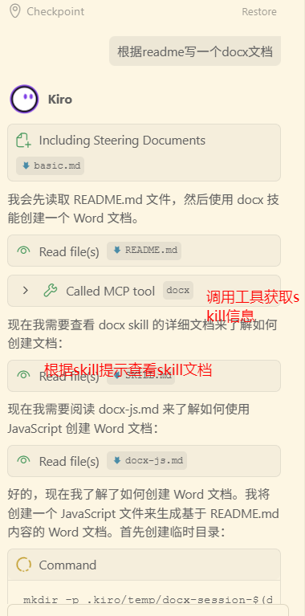

# MCP Skills Explorer

[](https://www.npmjs.com/package/mcp-skills-explorer)
[](https://www.npmjs.com/package/mcp-skills-explorer)
[](https://nodejs.org/)
[](https://www.typescriptlang.org/)
[](https://modelcontextprotocol.io/)
[](LICENSE)

一个MCP服务器，能够自动读取 `claude-skills`标准文件夹中的 `skill.md` 文件生成mcp工具，让不支持claude-skills的agent通过mcp的方式使用上skill.

## 📖 快速示例

本项目在 `./test/claude-skills/` 目录下提供了一个完整的 docx skill 示例，演示如何将 Claude Skills 转换为 MCP 工具。

### 配置示例

在 MCP 配置文件中添加以下配置：

```json
{
  "mcpServers": {
    "mcp-skills-explorer": {
      "command": "npx",
      "args": ["-y", "mcp-skills-explorer"],
      "env": {
        "SKILLS_DIR": "test/claude-skills"
      },
      "disabled": false,
      "autoApprove": ["docx"]
    }
  }
}
```

### 工作原理

1. **扫描**: 服务器自动扫描 `SKILLS_DIR` 指定的目录
2. **解析**: 读取每个 skill 文件夹中的 `SKILL.md` 文件
3. **注册**: 将 skill 转换为 MCP 工具并注册到服务器
4. **使用**: Agent 可以通过 MCP 协议调用这些工具

### 效果展示

配置完成后，docx skill 会被自动注册为 MCP 工具，Agent 可以直接使用：




**📦 npm 包**: https://www.npmjs.com/package/mcp-skills-explorer

## ✨ 特性

- 🚀 **自动化** - 自动扫描和注册 skills，无需手动配置
- 📝 **简单易用** - 使用 Markdown 格式定义 skills
- 🔧 **完全兼容** - 完整实现 MCP 协议规范
- 🌍 **多语言支持** - 完美支持中文和其他语言
- ⚡ **高性能** - 快速启动和响应
- 🎯 **模块化** - 清晰的代码结构，易于扩展

## 📦 安装方式

### 方式 1: 使用 npx（推荐）

无需安装，直接运行：

```bash
npx mcp-skills-explorer
```

### 方式 2: 全局安装

```bash
npm install -g mcp-skills-explorer
mcp-skills-explorer
```

### 方式 3: 从源码安装

```bash
# 克隆项目
git clone <your-repo-url>
cd mcp-skills-explorer

# 安装依赖
npm install

# 构建项目
npm run build

# 启动服务器
npm start
```

## 🎯 使用方法

编辑 MCP 配置文件：
- **Claude Desktop (Windows)**: `%APPDATA%\Claude\claude_desktop_config.json`
- **Claude Desktop (Mac)**: `~/Library/Application Support/Claude/claude_desktop_config.json`
- **Kiro**: `.kiro/settings/mcp.json`

#### 方式 A: 使用 npx（推荐，无需安装）

从 npm 中央仓库直接运行：

```json
{
  "mcpServers": {
    "skills-explorer": {
      "command": "npx",
      "args": ["-y", "mcp-skills-explorer"],
      "env": {
        "SKILLS_DIR": "C:/path/to/your/claude-skills"
      }
    }
  }
}
```

**优点**：
- ✅ 无需手动安装
- ✅ 自动使用最新版本
- ✅ 跨平台兼容

#### 方式 B: 使用全局安装的 npm 包

先全局安装：
```bash
npm install -g mcp-skills-explorer
```

然后配置：
```json
{
  "mcpServers": {
    "skills-explorer": {
      "command": "mcp-skills-explorer",
      "env": {
        "SKILLS_DIR": "C:/path/to/your/claude-skills"
      }
    }
  }
}
```

**优点**：
- ✅ 启动速度快
- ✅ 版本固定，稳定可控

#### 方式 C: 使用本地开发版本

从源码构建后使用：

```json
{
  "mcpServers": {
    "skills-explorer": {
      "command": "node",
      "args": ["C:/path/to/mcp-skills-explorer/dist/index.js"],
      "env": {
        "SKILLS_DIR": "C:/path/to/your/claude-skills"
      }
    }
  }
}
```

**优点**：
- ✅ 适合开发和调试
- ✅ 可以自定义修改代码

**配置完成后**，重启 Claude Desktop 或在 Kiro 中重新连接 MCP 服务器即可使用！

## 📚 文档

- **打包发布**: [package/](./package/) - 完整的 npm 发布指南
- **变更日志**: [CHANGELOG.md](./CHANGELOG.md) - 版本更新记录

## 🏗️ 项目结构

```
mcp-skills-explorer/
├── src/                          # 源代码
│   ├── config/                   # 配置管理
│   ├── handler/                  # 请求处理
│   ├── parser/                   # 元数据解析
│   ├── registry/                 # 工具注册
│   ├── scanner/                  # Skill 扫描
│   ├── server/                   # MCP 服务器
│   ├── types/                    # 类型定义
│   └── index.ts                  # 入口文件
├── dist/                         # 编译输出（发布到 npm）
├── test/                         # 测试和示例
│   └── claude-skills/            # 示例 skills
├── package/                      # 打包发布相关
│   ├── GUIDE.md                  # 完整发布指南
│   ├── publish.sh                # 发布脚本
│   └── README.md                 # 文件夹说明
├── package.json                  # 项目配置
├── tsconfig.json                 # TypeScript 配置
├── .npmignore                    # npm 发布忽略文件
├── CHANGELOG.md                  # 变更日志
└── README.md                     # 项目说明
```


## 🔧 开发

### 开发模式

```bash
npm run dev
```

### 构建

```bash
npm run build
```

## 🚀 性能

- 启动时间: < 1 秒
- Skills 扫描: < 100ms
- 工具列表响应: < 50ms
- 工具调用响应: < 100ms

## 🔗 相关链接

- **npm 包**: https://www.npmjs.com/package/mcp-skills-explorer
- **MCP 协议**: https://modelcontextprotocol.io/
- **Claude Desktop**: https://claude.ai/

## 🤝 贡献

欢迎贡献代码、报告问题或提出建议！

## 📄 许可证

MIT License

## 🙏 致谢

- [Model Context Protocol](https://modelcontextprotocol.io/)
- [Claude Desktop](https://claude.ai/)
- [npm 社区](https://www.npmjs.com/)

---

**Made with ❤️ for the Claude community**

如果觉得有用，欢迎 ⭐ Star 支持！
